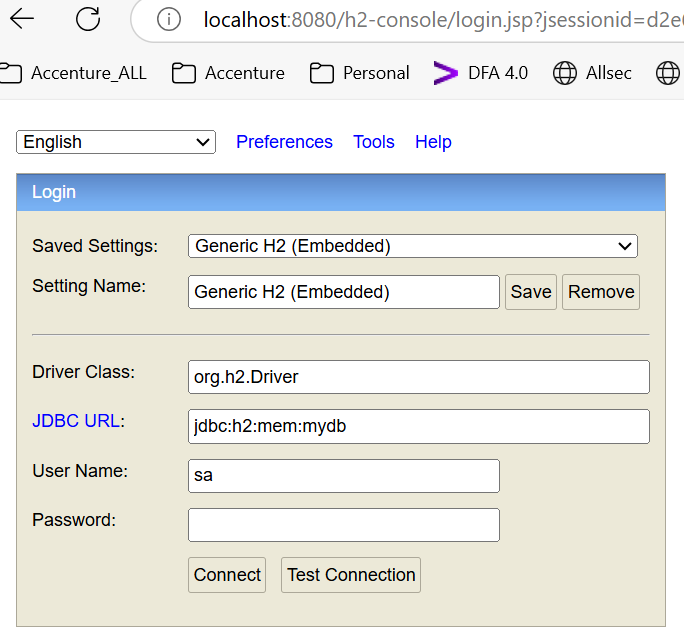

-----------------------------------------------------------------------------------

Main purpose of this project is intended to practice git commands like 
-------------------------------------------------------------------------------
git merge
// Whenever one branch(for ex:- A branch) needs to be merged with 
//other branch(for ex:- B branch)   it always create 
//new commit id for merge along with other commit ids of A

git rebase
//Same as above command but it will not create new commit id for merge command

git rebase -i head~3
//We can use above command,
//if we want to squash and merge all 3 commit ids under head into single commit 

------------------------------------------------------------------------------------
--------------------------------------------------------------------------------------

Use below api request to get all actuator links:-

--------------------------------------------------------------------------------------
--------------------------------------------------------------------------------------
curl --location 'http://localhost:8080/test' \
--header 'Content-Type: application/json' \
--data '{
"_links": [
{
"href": "http://localhost:8080/actuator",
"templated": false
},
{
"href": "http://localhost:8080/actuator/beans",
"templated": false
},
{
"href": "http://localhost:8080/actuator/caches/{cache}",
"templated": true
},
{
"href": "http://localhost:8080/actuator/caches",
"templated": false
},
{
"href": "http://localhost:8080/actuator/health",
"templated": false
},
{
"href": "http://localhost:8080/actuator/health/{*path}",
"templated": true
},
{
"href": "http://localhost:8080/actuator/info",
"templated": false
},
{
"href": "http://localhost:8080/actuator/conditions",
"templated": false
},
{
"href": "http://localhost:8080/actuator/configprops",
"templated": false
},
{
"href": "http://localhost:8080/actuator/configprops/{prefix}",
"templated": true
},
{
"href": "http://localhost:8080/actuator/env",
"templated": false
},
{
"href": "http://localhost:8080/actuator/env/{toMatch}",
"templated": true
},
{
"href": "http://localhost:8080/actuator/loggers",
"templated": false
},
{
"href": "http://localhost:8080/actuator/loggers/{name}",
"templated": true
},
{
"href": "http://localhost:8080/actuator/heapdump",
"templated": false
},
{
"href": "http://localhost:8080/actuator/threaddump",
"templated": false
},
{
"href": "http://localhost:8080/actuator/metrics",
"templated": false
},
{
"href": "http://localhost:8080/actuator/metrics/{requiredMetricName}",
"templated": true
},
{
"href": "http://localhost:8080/actuator/sbom",
"templated": false
},
{
"href": "http://localhost:8080/actuator/sbom/{id}",
"templated": true
},
{
"href": "http://localhost:8080/actuator/scheduledtasks",
"templated": false
},
{
"href": "http://localhost:8080/actuator/mappings",
"templated": false
}
]
}'
-----------------------------------------------------------------------------
//Demonstrating on hibernate different mapping or association like
-------------------------------------------------------------------------------
one to one
one to many
many to many

Used in memory h2 database and to access database please see the pic below

JDBC URL : jdbc:h2:mem:mydb
Username : sa
Password : sa
-------------------------------------------------------------------------------
